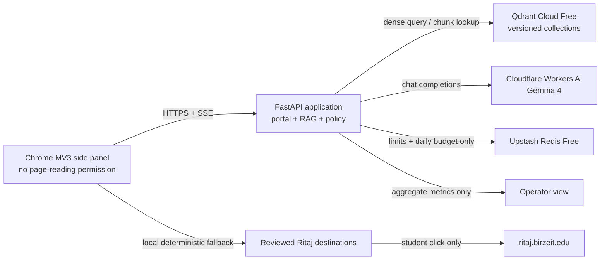

# Ritaj Assistant: zero-cost production and Chrome extension plan

> **MOSTLY EXECUTED — 20 August 2026.** The P0 list in §4 is closed except
> the corpus, and the system described here is live. §6 (free-tier hosting
> research) remains useful reference. **§10's advice to reduce `max_tokens`
> to 350–500 is WITHDRAWN** — the model reasons before answering and that
> budget returns empty answers; see FUTURE_PLAN.md §5.
> Current forward plan: **[FUTURE_PLAN.md](FUTURE_PLAN.md)**.

**Prepared:** 15 August 2026  
**Repository:** `ritaj-rag-chatbot`  
**Purpose:** turn the existing project into a truthful, secure, live student pilot with a Chrome side-panel extension, a separately hosted LLM, and a free vector database.  
**Important:** “free production” has no uptime or capacity guarantee. The plan below targets a controlled student pilot at $0, with explicit limits and rollback paths. General availability needs either sponsorship or acceptance of free-tier outages.

---

## 1. Executive decision

Use the existing architecture and release it in two stages.

### Stage A — navigation-first base

Ship the approved Chrome extension as a **Ritaj-styled side panel** whose reviewed page-finder remains useful even when chat is unavailable. It should open only human-approved `https://ritaj.birzeit.edu/...` destinations after a student clicks. It must not read the Ritaj page, cookies, account, grades, schedule, balance, or forms.

This stage can become useful before a production corpus exists. At present, the extension cannot do that: every request is blocked by backend readiness, all five navigation actions are disabled, and the live backend is down.

### Stage B — grounded RAG chat

Enable factual answers only after authorized Ritaj snapshots are approved, indexed, and pass the release evaluation. Use:

- **Chrome extension:** current Manifest V3 side panel, updated and republished as a new version.
- **Application host:** repair and reuse the existing Hugging Face Docker Space for the first pilot, if the account remains eligible for CPU Basic; keep Oracle A1 as the $0 fallback.
- **LLM:** Cloudflare Workers AI, `@cf/google/gemma-4-26b-a4b-it`.
- **Vector database:** Qdrant Cloud Free, with a versioned-collection/alias deployment design and a recoverable local artifact.
- **Small persistent state:** Upstash Redis Free for shared rate limits and the daily model budget. If the pilot stays on exactly one process and one replica, this may be postponed, but restarts will reset limits.
- **Portal:** keep the React portal served by FastAPI for the first release; splitting it onto a static host does not solve the model-heavy backend.

The extension contains no model and no secret. The application server receives student questions, retrieves approved chunks, and sends only the bounded conversation plus retrieved excerpts to the LLM provider.

---

## 2. What was reviewed

The audit covered the 213 tracked files plus the current untracked work, excluding generated caches, `.venv`, `.git`, `node_modules`, ignored Qdrant runtime data, and compiled artifacts except where the packaged ZIP itself mattered.

| Area | Reviewed |
|---|---|
| Backend | 33 Python modules under `src/ritaj/` |
| Tests | 13 backend test files |
| Release tooling | 23 scripts, Dockerfile, lockfiles, SBOM and CI workflow |
| Chrome extension | manifest, side panel, worker, navigation policy, tests, icons, ZIP and Store material |
| Web portal | React/TypeScript source, API clients, styles, assets, Vite and ESLint config |
| RAG data | source manifest, navigation registry, links, evaluation set and quarantined documents |
| Governance | release, deployment, operations, privacy, security and ADR documents |

No existing user change was overwritten. This file is new because the worktree already contains extensive modified plans and application work.

### Verification performed during this review

- `pytest -q`: **361 passed**, with one Starlette/httpx deprecation warning.
- Portal `npm run lint`: passed.
- Portal `npm run build`: passed.
- `npm audit --omit=dev`: **0 vulnerabilities**.
- Python locked-dependency audit: exited successfully with no reported finding.
- Extension navigation tests: **9 passed**.
- Corpus, navigation, extension, privacy and model-free release checks: passed.
- Model-free navigation evaluation: **22 cases, 100% destination precision and 100% intent recall**.
- SBOM/current-tree and image/dependency pinning checks: passed.
- Live probes to `/live`, `/ready` and `/privacy`: **HTTP 503**; the public response says the Space is in error.
- The public Space API reports `RUNTIME_ERROR`, last modified 6 July 2026, while this repository has newer code and extensive uncommitted work.

### Release gates that currently fail

- Zero approved corpus sources and no published corpus artifact.
- All five navigation actions are disabled and lack named approval.
- The answerable set is `0/100`; calendar set is `0/25`.
- Nine operating duties have no primary/backup owner.
- Four rollback/secret-rotation drills have no recorded rehearsal.
- Store screenshots show the removed popup and make claims the current product cannot support.

---

## 3. Current strengths to keep

The project is not a prototype from scratch. Preserve these controls:

- MV3 side panel with Arabic/English, RTL, dark mode and bounded local history.
- Streaming chat with stop/cancel.
- Exact-domain, reviewed navigation; the LLM never creates a URL.
- Independent server and extension destination validation.
- Ritaj-only source policy, human approval, hashes, dates and freshness windows.
- Hybrid dense + BM25 retrieval, RRF fusion, reranking and abstention.
- Prompt-injection scanning/redaction and grounded-answer checking/repair.
- Explicit liveness/readiness states and background initialization.
- Request/body/history limits, concurrency caps, rate limits and a daily LLM budget.
- Production fail-closed configuration.
- Aggregate-by-default telemetry and stated retention.
- Reproducible extension packaging, locked dependencies, SBOM and release gates.
- Clear “independent student project” disclosure.

---

## 4. Blocking findings and required decisions

| Priority | Finding | Why it blocks production | Required outcome |
|---|---|---|---|
| P0 | No approved Ritaj corpus | The service intentionally cannot become ready or answer facts | Obtain authorized snapshots, owner approval, hashes and dates |
| P0 | Live Space is in `RUNTIME_ERROR` | Store users currently reach a dead backend | Inspect build/runtime logs, configure secrets, deploy reviewed tag, prove three cold starts |
| P0 | All navigation actions are disabled | The page-finder feature returns no destinations | Confirm each URL in a real Ritaj session and record approver/owner |
| P0 | Navigation depends on full RAG readiness | The useful page-finder dies whenever corpus/model/quota is down | Add a deterministic navigation-only path that does not require LLM or corpus readiness |
| P0 | `tabs.query({url: ...})` is used without `tabs` or Ritaj host access | Chrome gates querying tab URLs behind those permissions | Remove tab reuse and always use `chrome.tabs.create`, preserving minimal permissions |
| P0 | Qdrant Cloud auth/mode is not implemented | `QDRANT_API_KEY` is absent and Docker always defaults to embedded `QDRANT_PATH` | Add explicit embedded/remote mode, API key and TLS; test both modes |
| P0 | Current remote rebuild deletes the active collection | `vectorstore.reset()` causes downtime/data loss on a live remote DB | Use versioned collections and an atomic `ritaj_current` alias switch |
| P1 | Source links are trusted as raw backend URLs | A compromised backend could render an arbitrary link | Validate source links in the extension against a separate official-domain/path policy |
| P1 | In-memory budget/rate limits reset on restart | Free-host restarts reopen quota and abuse windows | Persist counters in Upstash or accept one-instance/reset risk for closed alpha only |
| P1 | Extension screenshots/copy are stale | They show a popup and unsupported fee/grade claims | Recapture the actual side panel after corpus and UI are final |
| P1 | Extension and portal style diverge | Extension uses red while the portal uses deep green/gold | Adopt one bundled design-token system and preserve the independent label |
| P1 | Portal ignores sources, grounding and navigation SSE events | Web and extension give different evidence/behavior | Bring portal client to the same v2 event contract |
| P1 | Admin loads Plotly remotely and stores bearer token in local storage | Supply-chain/XSS exposure can compromise operator access | Self-host the asset; move auth to secure cookie or harden token storage and CSP |
| P1 | Runtime state/logs live under `/tmp` | Free-host restart loses calibration and operational history | Store only necessary counters/config in managed state; keep raw chat text off by default |
| P2 | Documentation versions and hosting facts drift | Operators can deploy the wrong dependency/provider setup | Generate dependency facts where possible and date every free-tier assumption |

The Chrome documentation confirms that tab creation/navigation needs no `tabs` permission, but querying sensitive URL properties does. See [Chrome Tabs API permissions](https://developer.chrome.com/docs/extensions/reference/api/tabs#permissions). The current side-panel click pattern itself is supported; see [Chrome Side Panel API](https://developer.chrome.com/docs/extensions/reference/api/sidePanel).

---

## 5. Target system



### Trust boundaries

1. The extension trusts neither model output nor arbitrary backend URLs.
2. The backend indexes only approved public Ritaj snapshots.
3. The LLM receives no API credentials, page DOM, cookies, login session or student record.
4. The model provider key, Qdrant key, admin hashes and session secret exist only in host secret storage.
5. Navigation still works when the LLM quota is exhausted.
6. Factual chat abstains if no approved source supports the answer.

---

## 6. Free hosting research and selection

Limits below were verified from official provider documentation on 15 August 2026. Recheck them immediately before provisioning; free tiers change.

### Application hosting

| Host | Current free facts | Fit for this repository | Decision |
|---|---|---|---|
| [Hugging Face CPU Basic](https://huggingface.co/docs/hub/spaces-overview) | 2 vCPU, 16 GB RAM, 50 GB non-persistent disk, $0 hardware; free CPU sleeps after 48 hours. Current docs also say creating a compute Space requires a paid plan. | Enough memory for the current E5/reranker image; slow CPU/cold start; current Space already exists but is broken | **Primary for the first pilot only if the existing account remains eligible** |
| [Oracle Always Free A1](https://docs.oracle.com/en-us/iaas/Content/FreeTier/freetier_topic-Always_Free_Resources.htm) | Currently equivalent to 2 OCPU/12 GB RAM plus free block storage; capacity can be unavailable; idle instances may be reclaimed | Can host the app with remote LLM/DB, or a small quantized LLM, but not both without measurement | **Fallback host and self-host experiment** |
| [Render Free](https://render.com/docs/free) | Sleeps after 15 idle minutes, about one-minute wake, ephemeral disk, 750 instance-hours/month; provider says not for production | Current ML image is too heavy; viable only after remote embeddings/reranking | Reject for current build; optional lightweight API preview |
| [Koyeb Free](https://www.koyeb.com/docs/reference/instances) | 0.1 vCPU, 512 MB RAM, 2 GB SSD, sleeps after one idle hour; provider says not for production | Far too small for local E5/reranker | Reject for current build; optional lightweight API preview |
| [Railway](https://railway.com/pricing) | 30-day/$5 trial, then $1/month on the Free plan, 0.5 GB RAM | Not truly $0 long-term and too small for current models | Reject for the zero-cost target |
| [Cloudflare Workers](https://developers.cloudflare.com/workers/platform/pricing/) | 100,000 requests/day on Free, but 10 ms CPU per invocation | Excellent edge/API host only after a substantial TypeScript/serverless port | Later optimization, not the base release |

There is no honest free host here with a production SLA. The rollout and extension copy must treat this as an experimental student service with clear outage behavior.

### LLM hosting

**Preferred:** [Cloudflare Workers AI](https://developers.cloudflare.com/workers-ai/platform/pricing/).

- Free allocation: 10,000 neurons/day, reset at 00:00 UTC.
- Gemma 4 26B A4B is currently priced at 9,091 neurons/M input tokens and 27,273 neurons/M output tokens.
- A representative 4,000-input/500-output-token RAG response is about 50 neurons: roughly 200/day at the provider ceiling or 180/day at the existing 9,000-neuron application budget.
- The current client already speaks the provider’s OpenAI-compatible chat endpoint.
- No LLM weight needs to be uploaded by this team; only three server-side values are needed: base URL, model ID and scoped token.

Cloudflare also hosts [multilingual BGE-M3 embeddings](https://developers.cloudflare.com/ai/models/%40cf/baai/bge-m3/) and a BGE reranker. Moving these off the application host is a later, evaluation-gated optimization that can make the API small enough for Render/Koyeb or a Worker. Do not change embedding models without rebuilding the index and rerunning Arabic/English retrieval evaluation.

**Self-host fallback:** Oracle A1 with one quantized Gemma 4 E2B model behind Caddy/Nginx and a bearer-token check. Use the split topology: the app stays elsewhere and Oracle serves only the LLM. Benchmark first-token latency, tokens/second, peak RSS and two-request concurrency. Do not expose Ollama port 11434 directly.

### Vector database

**Selected:** [Qdrant Cloud Free](https://qdrant.tech/documentation/cloud/create-cluster/).

- 0.5 vCPU, 1 GB RAM, 4 GB disk, one node, no credit card.
- Qdrant estimates about one million 768-dimensional vectors; this project’s expected corpus is tiny by comparison even with a 1024-dimensional model.
- No uptime SLA, no HA and manual snapshots only.
- An unused free cluster is suspended after one week and deleted after four weeks of inactivity if not reactivated.
- [Cloud Inference](https://qdrant.tech/documentation/cloud/inference/) offers selected free embedding models, but exact Arabic quality/model availability must be verified and evaluated before adoption.

Keep the existing embedded Qdrant artifact as the backup/restore source. The service must be able to rebuild a new cloud collection from `chunks.jsonl` and the approved source manifest.

**Alternative:** [Cloudflare Vectorize](https://developers.cloudflare.com/vectorize/platform/pricing/) includes 5 million stored vector dimensions and 30 million queried dimensions/month. At 1,024 dimensions this is only about 4,882 stored vectors, probably enough for the first Ritaj corpus, but migration would replace the current Qdrant seam. Use only if consolidating onto Cloudflare later.

### Small state store

[Upstash Redis Free](https://upstash.com/pricing/redis) currently includes 256 MB, 500,000 commands/month and 10 GB bandwidth. Use it for:

- hashed network/session rate-limit windows;
- daily neuron/call counters with TTL at the UTC reset;
- the navigation kill-switch version;
- at most small aggregate operational counters.

Do not store raw questions, answers, Ritaj pages or student identifiers there. If Redis work is postponed, keep one application process/replica and document that restarts reset limits.

---

## 7. Chrome extension production work

### 7.1 One-click side-panel behavior

The current side-panel choice already satisfies “chat pops up when pressed.” Keep the side panel instead of restoring a toolbar popup; a popup closes when the student returns to Ritaj.

Required changes:

- Set and test toolbar-click side-panel behavior on install and startup.
- Add `minimum_chrome_version` matching the oldest tested Side Panel API behavior.
- Remove the permission-incompatible Ritaj-tab query. Open a new reviewed tab with `chrome.tabs.create()`.
- Check `chrome.runtime.lastError`/Promise rejection and show a local failure message.
- Keep permissions at `storage` and `sidePanel`; do not add `tabs`, `activeTab`, `scripting`, `cookies`, `history` or Ritaj host access.
- Keep all code, fonts and images inside the extension package; no remote JavaScript or CDN.

### 7.2 Navigation-first fallback

Make navigation independent of RAG availability:

1. Bundle the approved action IDs, labels, paths and exact intent aliases in the extension, or expose a lightweight signed/versioned capability document and cache the last approved copy.
2. Resolve only deterministic reviewed phrases; no model-created URL.
3. Render a permanent “Find a Ritaj page” section with registration, calendar, courses, announcements and portal-home buttons only after each action is approved.
4. Validate the destination again in the service worker.
5. Require an explicit click and display `ritaj.birzeit.edu` before opening.
6. If chat is down/quota-exhausted, keep these buttons usable and explain that factual answers are temporarily unavailable.

The backend should also gain a lightweight `/v2/navigation/resolve` route whose readiness depends only on the approved navigation registry, not the vector store or LLM. Local extension resolution remains the outage fallback.

### 7.3 Ritaj-inspired visual design

Use the existing portal’s deep green/gold language as the shared design system; the current extension’s red accent is inconsistent.

- Primary: deep Ritaj green; secondary: warm gold; surfaces: white/off-white; status colors must meet WCAG AA.
- Bundle a Cairo Arabic/Latin variable-font subset or use a reliable local system stack; never load a web font remotely.
- Arabic first, complete RTL mirroring, visible Arabic/English toggle.
- Compact header: local assistant mark, “Ritaj Assistant / مساعد ريتاج,” online/degraded status, language and clear-history controls.
- Home: clear independent-project notice, quick navigation cards and safe suggestions.
- Transcript: distinct user/assistant bubbles, cited-source cards, freshness badge, verified-domain button and copy control.
- Composer: multiline, character counter near the limit, Send/Stop, Enter-to-send with Shift+Enter newline.
- Responsive from 260 px upward and usable at 200% zoom.
- Visible focus, keyboard navigation, 44 px tap targets, reduced-motion support and screen-reader announcements.
- Do not use Birzeit’s official seal/logo or copy the authenticated dashboard so closely that the extension looks official without written permission.

### 7.4 Link and event safety

- Validate both navigation actions **and source links**. Permit only HTTPS and explicitly reviewed official hosts/paths.
- Reject credentials, non-443 ports, fragments, whitespace, backslashes, traversal and unregistered queries.
- Add tests for `javascript:`, `data:`, lookalike hosts, Unicode/punycode, suffix tricks and malformed URLs.
- Parse SSE across chunk boundaries and CRLF/LF separators; ignore unknown event types.
- Render only cited sources, not every retrieved passage. Preserve raw citations server-side for verification while displaying clean answer text.
- Display the stable request ID on errors so support can correlate a report without collecting the question.
- Add exponential retry only for `INITIALIZING`; do not retry quota, validation or grounded refusals automatically.

### 7.5 Store update

- Keep the existing approved listing and upload a new version; do not create a second product.
- Replace all three screenshots with real side-panel captures in Arabic and English.
- Remove claims about fees, grades, “anything Birzeit,” complete privacy, official status or guaranteed availability.
- Ensure the public privacy URL works before submission.
- Update host permission/CORS/privacy copy together if the API origin changes.
- Package from a clean signed/tagged release; record ZIP SHA-256 and test the ZIP, not only source files.

---

## 8. Corpus and RAG data plan

This is the critical path. Do not bypass Ritaj’s Cloudflare challenge and do not promote search-result summaries or cached third-party text.

### Approved acquisition routes

Use one or more of:

- authorized Computer Center/API export;
- content-owner export from Registration/Student Affairs;
- deliberate save/export of a public page by an authorized reviewer;
- written authorization for an automated snapshot job.

Never ingest authenticated student-specific pages, cookies, form data, names/directories, grades, schedules, balances or messages.

### Per-source workflow

1. Confirm the canonical Ritaj URL and whether it is public or login-gated.
2. Save a clean HTML/Markdown/PDF snapshot under a versioned snapshot directory.
3. Remove navigation, scripts, unrelated boilerplate and any personal data.
4. Record title, language, owner, fetch timestamp, effective dates and refresh frequency.
5. Compute SHA-256 and verify it against the stored content.
6. Obtain named role/ticket approval; then and only then set `approved: true`.
7. Run source-policy and prompt-injection checks.
8. Build a versioned corpus artifact offline.
9. Upload into a new Qdrant collection and switch the alias only after validation.
10. Keep the prior two corpus versions for instant rollback.

Start with a narrow pilot corpus: registration instructions, current academic calendar and stable course-browser help in Arabic and English. Live seat counts, deadlines and announcements should usually be navigation-only because snapshots age too quickly.

### Release evaluation

Before factual chat is enabled:

- at least 100 answerable cases;
- at least 25 calendar/date cases;
- at least 20 navigation cases;
- retrieval recall@10 ≥ 95%;
- supported-answer accuracy ≥ 90%;
- citation precision ≥ 95%;
- unsupported factual claims < 2%;
- correct refusal ≥ 95%;
- navigation destination precision = 100%;
- separate Arabic and English result tables;
- content-owner sign-off on sampled answers.

---

## 9. Qdrant Cloud implementation plan

The current code cannot safely use Qdrant Cloud as-is.

### Configuration changes

Add:

```dotenv
QDRANT_MODE=remote
QDRANT_URL=https://<cluster>.<region>.cloud.qdrant.io:6333
QDRANT_API_KEY=<host-secret>
QDRANT_COLLECTION_ALIAS=ritaj_current
QDRANT_TIMEOUT_SECONDS=10
```

- `QDRANT_MODE=embedded` uses `QDRANT_PATH` and must reject a cloud key.
- `QDRANT_MODE=remote` uses URL + API key and must ignore/unset `QDRANT_PATH`.
- Production validation must reject ambiguous or insecure combinations.
- Never log the key or full authenticated URL.

### Safe indexing

- Build collection `ritaj_<corpus-version>`.
- Upsert in bounded batches with retry and checksum/count verification.
- Create payload indexes only for fields used in filters.
- Run retrieval/evaluation against the new collection.
- Atomically point alias `ritaj_current` to it.
- Keep the prior collection until the rollout is stable.
- Never call delete/recreate on the live alias target.
- Take a manual Qdrant snapshot and keep the immutable local corpus artifact.

### Payload contract

Each point should contain only:

- stable chunk/source IDs;
- approved text chunk;
- canonical URL and title;
- language, visibility, fetch/effective dates and freshness data;
- source checksum/corpus version;
- section/chunk position.

No chat history, student identifier, IP address, cookies or account data belongs in Qdrant.

---

## 10. LLM and model-serving plan

### Cloudflare pilot

Host secrets/configuration:

```dotenv
LLM_BASE_URL=https://api.cloudflare.com/client/v4/accounts/<ACCOUNT_ID>/ai/v1
LLM_MODEL=@cf/google/gemma-4-26b-a4b-it
LLM_API_KEY=<scoped Workers AI inference token>
LLM_DAILY_NEURON_BUDGET=9000
MAX_CONCURRENT_GENERATIONS=2
```

Keep temperature at 0.2 or lower. Reduce the current 1,024-token maximum after evaluation; 350–500 output tokens should usually be enough for concise navigation/help answers and materially extends the free quota. Trigger follow-up condensation only when a question is actually referential instead of on every turn with history.

Acceptance checks:

- provider contract test for normal and streaming responses;
- actual usage block recorded and reconciled against the dashboard;
- timeout, 429, 5xx, malformed JSON and mid-stream failure tests;
- circuit breaker and budget persist across app restarts;
- p50 first token ≤ 3 seconds and p95 complete answer ≤ 12 seconds under pilot load;
- graceful `LLM_BUDGET_EXHAUSTED` while navigation remains available.

### Self-host alternative

If independence is mandatory, place only the quantized LLM on Oracle:

- one reviewed Gemma 4 E2B quantization/model manifest;
- context window only as large as evaluated prompts require;
- one or two generation slots, bounded queue and keep-alive;
- loopback Ollama/llama.cpp port;
- HTTPS reverse proxy with bearer-token validation;
- firewall exposes only SSH from operator IPs and HTTPS;
- automatic security updates, monitoring and encrypted configuration backup.

Do not claim “unlimited” availability: Oracle documents capacity limits and idle-instance reclamation, and CPU generation may miss the latency target.

### Later lightweight application option

Introduce provider interfaces for embeddings and reranking. Evaluate Cloudflare BGE-M3 + BGE reranker against the current local E5-large/BGE-M3 stack. If quality gates pass, remove `torch` and `sentence-transformers` from the serving image while retaining them in an offline evaluation profile. This enables a small API host and much faster cold starts.

---

## 11. Backend production work

### API modes

Split readiness into capabilities:

- `live`: process responds; no dependency call.
- `navigation_ready`: approved registry loaded; independent of corpus/LLM.
- `retrieval_ready`: vector DB and embedder work.
- `generation_ready`: provider configuration/circuit/budget allow generation.
- `ready`: full factual chat ready.

Return this from `/capabilities` and let clients degrade feature by feature.

### Persistent limits

- Move network/session sliding windows and daily neuron usage to Upstash with atomic operations and TTL.
- Hash IP/session values using a rotating server-side salt; never store raw IP.
- Keep campus-NAT limits higher than per-session limits.
- Confirm `TRUSTED_PROXY_COUNT` from real host headers; never guess.
- CORS is not authentication. Keep exact portal + published extension origins, but expect non-browser callers and enforce server-side limits.

### Security hardening

- Add HSTS, `X-Content-Type-Options`, restrictive CSP, `Referrer-Policy` and frame restrictions.
- Serve Plotly/admin dependencies locally or remove them.
- Prefer short-lived admin sessions in `Secure; HttpOnly; SameSite=Strict` cookies plus CSRF protection. If bearer storage remains, document residual XSS risk.
- Bound admin login fields and preserve brute-force limiting.
- Keep `/admin/*` closed in production and separate staging/production credentials.
- Remove the deprecated `user` field and unused `current_ritaj_path` after client compatibility is confirmed.
- Do not expose provider bodies, file paths, account IDs or secrets to public clients.
- Keep `CHAT_LOG_MODE=aggregate`; raw-text mode must remain disabled unless a separate consented study is approved.

### Correctness and reliability

- Return cited sources only, including capture/effective dates and freshness.
- Validate every page link at build time and request time.
- Use one stable v2 SSE schema and contract tests shared by extension and portal.
- Add `Cache-Control: no-store` on chat/admin responses; cache immutable frontend assets.
- Keep one process while local ML models are loaded; horizontal scaling requires shared limits and a remote DB.
- Add a scheduled external probe for `/live`, `/ready` and one deterministic navigation case. It must not consume LLM quota.

---

## 12. Deployment configuration and secrets

### Runtime secrets

| Secret | Where | Scope |
|---|---|---|
| `LLM_API_KEY` | Application host | Workers AI inference only |
| `QDRANT_API_KEY` | Application host and offline index job | One cluster/project; rotate after exposure |
| `ADMIN_USERS` | Application host | bcrypt hashes only, no plaintext passwords |
| `SESSION_SECRET` | Application host | random signing key, separate by environment |
| Upstash URL/token | Application host | One database; least privilege available |

### Non-secret production settings

```dotenv
ENVIRONMENT=production
STARTUP_INIT=1
ALLOW_INDEX_BUILD_ON_BOOT=0
CHAT_LOG_MODE=aggregate
CHAT_LOG_RETENTION_DAYS=30
CORS_ORIGINS=https://<portal-host>
EXTENSION_ID=<published-store-extension-id>
MAX_MESSAGE_CHARS=2000
MAX_BODY_BYTES=32768
HISTORY_MAX_TURNS=8
HISTORY_MAX_CHARS=1500
```

`HF_TOKEN`, cloud account credentials and Chrome Web Store credentials are deployment credentials; do not inject them into the runtime container.

### Environment separation

- Local: Ollama + embedded Qdrant + development CORS.
- Staging: separate Qdrant collection/alias, separate admin/session secrets, same model class, unpublished/unpacked extension ID.
- Production: published extension ID, production alias, scoped production tokens and clean tagged artifact.

Never test a corpus rebuild or navigation candidate directly in production.

---

## 13. CI/CD and release sequence

### Phase 0 — establish a releasable tree

- [ ] Preserve/commit the current work on a reviewed branch.
- [ ] Reconcile `main`, `release` and `roadmap/2026-release`; protect the actual integration/release branch.
- [ ] Resolve the Starlette/httpx deprecation warning.
- [ ] Refresh stale dependency documentation from the lock/SBOM.
- [ ] Require passing backend, policy, frontend, security and load jobs.
- [ ] Make release-set completeness and operations checks blocking once external inputs exist.

### Phase 1 — useful navigation base

- [ ] Verify each Ritaj destination manually and record evidence.
- [ ] Name owner and approver for each enabled action.
- [ ] Implement navigation-only readiness/endpoint and local extension fallback.
- [ ] Remove permission-incompatible tab reuse.
- [ ] Validate source links separately.
- [ ] Test chat-down, quota-down and offline states.

### Phase 2 — final extension UI

- [ ] Apply shared green/gold/Cairo design tokens.
- [ ] Add navigation home, service status, cited-source cards and request-ID errors.
- [ ] Complete RTL, keyboard, zoom and screen-reader testing.
- [ ] Recapture truthful Store screenshots.

### Phase 3 — corpus

- [ ] Acquire approved Ritaj snapshots through an authorized route.
- [ ] Complete metadata, checksums, dates and content-owner approval.
- [ ] Build/publish versioned artifact.
- [ ] Complete and pass the Arabic/English release set.

### Phase 4 — database/state

- [ ] Provision Qdrant Cloud Free in the closest suitable region.
- [ ] Implement explicit remote mode/API key/TLS.
- [ ] Upload versioned collection, verify counts/checksums and switch alias.
- [ ] Create and test snapshot/restore.
- [ ] Provision Upstash and migrate shared counters, or document closed-alpha reset risk.

### Phase 5 — LLM

- [ ] Provision scoped Cloudflare token.
- [ ] Configure staging, run provider contract and real latency/budget tests.
- [ ] Tune prompt/context/output size within evaluation thresholds.
- [ ] Verify quota-exhaustion behavior.

### Phase 6 — application deployment

- [ ] Inspect current HF Space build/runtime logs.
- [ ] Confirm CPU Basic eligibility and storage/sleep behavior on the account.
- [ ] Configure every production secret and exact CORS origin.
- [ ] Build portal, container and corpus artifact from reviewed commit.
- [ ] Deploy staging; prove three cold starts and full smoke test.
- [ ] Tag and deploy production; verify `/live`, `/ready`, `/privacy`, navigation and one cited chat.

### Phase 7 — Store release

- [ ] Bump extension version.
- [ ] Build deterministically from tag and record checksum.
- [ ] Run unit, policy and real-Chromium E2E against the ZIP.
- [ ] Manually click the toolbar icon and confirm persistent side panel behavior.
- [ ] Upload new ZIP/screenshots/privacy answers to the existing Store item.
- [ ] Start Unlisted/limited rollout even if the listing is already approved.

### Phase 8 — operations

- [ ] Assign primary and backup for all nine duties in `docs/OPERATIONS.md`.
- [ ] Rehearse corpus, backend, navigation and secret rollbacks and record dates/durations.
- [ ] Add uptime/quota alerts and a support/correction path.
- [ ] Review source freshness on schedule.

---

## 14. Acceptance gates

### Extension

- Toolbar click opens the side panel on the minimum supported Chrome version.
- Panel survives navigation between tabs/pages.
- No content script and no Ritaj host, tabs, cookies or history permission.
- Every navigation URL passes independent server + extension validation.
- Navigation remains usable with backend 503, model outage and quota exhaustion.
- Local history cap/erase behavior matches the privacy policy.
- Arabic/English/RTL, keyboard-only, 200% zoom and screen-reader smoke tests pass.

### Backend/data

- Production refuses unsafe configuration.
- `/live` is fast and dependency-free; `/ready` accurately reflects full chat.
- Approved corpus is non-empty, hashed, current and recoverable.
- Qdrant alias points to the evaluated corpus version.
- Full evaluation thresholds in section 8 pass.
- Rate limits and budget survive restart if the service is public.
- No raw conversation text is retained by default.

### Performance/capacity

- Three cold starts succeed within host limits.
- p50 first token ≤ 3 seconds and p95 full answer ≤ 12 seconds on Cloudflare pilot.
- Two concurrent generations stay within memory and queue bounds.
- A 30-minute/target-concurrency soak shows no unbounded memory growth.
- Daily budget math is reconciled with provider dashboard usage.

### Store/privacy

- Public privacy page loads from the production URL.
- Listing, manifest, code and policy name the same backend/provider/data behavior.
- Screenshots show the side panel and only capabilities available in production.
- Independent/non-endorsed status is visible in Arabic and English.

---

## 15. Rollout and rollback

1. **Maintainer alpha:** deterministic navigation only; verify destinations and outage behavior.
2. **Closed 10–20 student pilot:** enable grounded chat with daily budget; collect aggregate failures and explicit feedback.
3. **Limited Store rollout for one week:** review errors, quota, latency, source freshness and correction requests every day.
4. **General availability:** only after every blocking gate is green and free-tier risk is accepted by named owners.

Rollback order:

- Bad destination: set registry action `enabled: false`, redeploy capability data, verify local extension fallback behavior/version.
- Bad corpus: repoint Qdrant alias to previous collection and redeploy matching manifest.
- Bad backend: deploy previous signed/tagged image/commit.
- LLM incident/quota: disable generation, keep navigation, show a truthful degraded banner.
- Suspected secret leak: revoke first, rotate host secret, invalidate sessions, then investigate logs.
- Extension bug: pause Store rollout and submit the prior safe package or a one-change hotfix; server-side kill switches must reduce risk while review is pending.

---

## 16. Definition of done

The base is production-ready only when all statements below are true:

- A Store-installed click opens a polished Ritaj-inspired side panel.
- The panel can find approved Ritaj pages without the model or corpus.
- The extension requests only `storage`, `sidePanel` and the one backend host.
- The public backend and privacy URL are live, with three successful cold-start tests.
- No secret or LLM/vector model is shipped in the extension.
- Cloudflare Gemma 4 works within a measured daily budget, or the UI degrades to navigation.
- Qdrant Cloud contains an evaluated, approved, versioned corpus and can be restored.
- Factual answers are concise, cited, fresh-aware and pass the release thresholds.
- The product never claims access to student records or official university status.
- Owners, alerts, retention, incident response and rehearsed rollback exist.

Until the approved corpus exists, the honest production state is **navigation assistant ready; factual RAG chat disabled**. That is still a useful student product and is safer than publishing a chat that guesses or promises capabilities it does not have.

---

## 17. First work order

Execute in this order:

1. Commit/review the current dirty worktree and choose the real release branch.
2. Fix `tabs.query({url})`, validate source links and add regression tests.
3. Add navigation-only readiness plus an offline/local reviewed-action fallback.
4. Verify and approve the five Ritaj destinations.
5. Repair the HF staging Space with complete secrets and collect cold-start logs.
6. Acquire and approve the narrow Arabic/English pilot corpus.
7. Add Qdrant Cloud remote auth/mode and versioned alias deployment.
8. Configure Cloudflare Workers AI in staging and complete the release evaluation.
9. Apply the green/gold/Cairo side-panel design and recapture Store assets.
10. Assign operators, rehearse rollback, tag/package/deploy, then begin the closed pilot.
